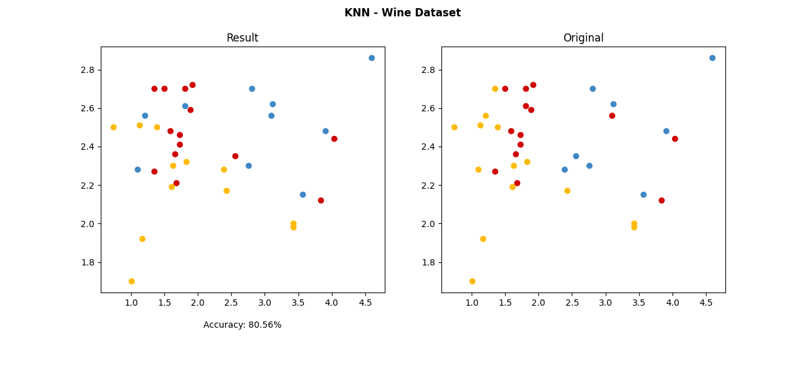
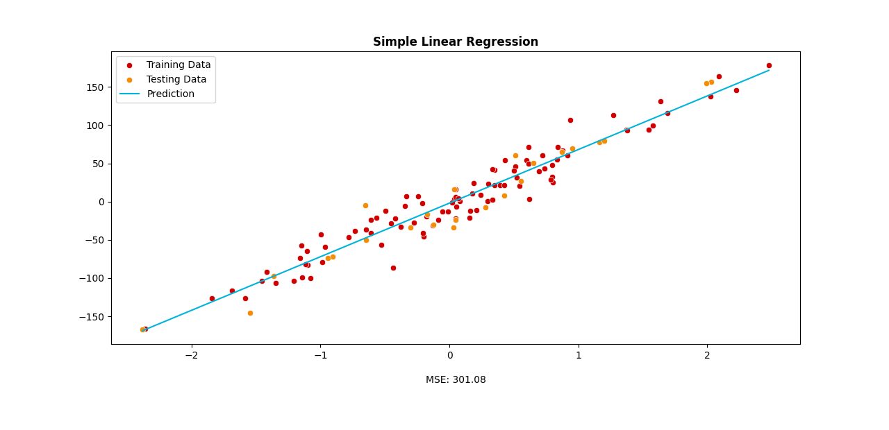
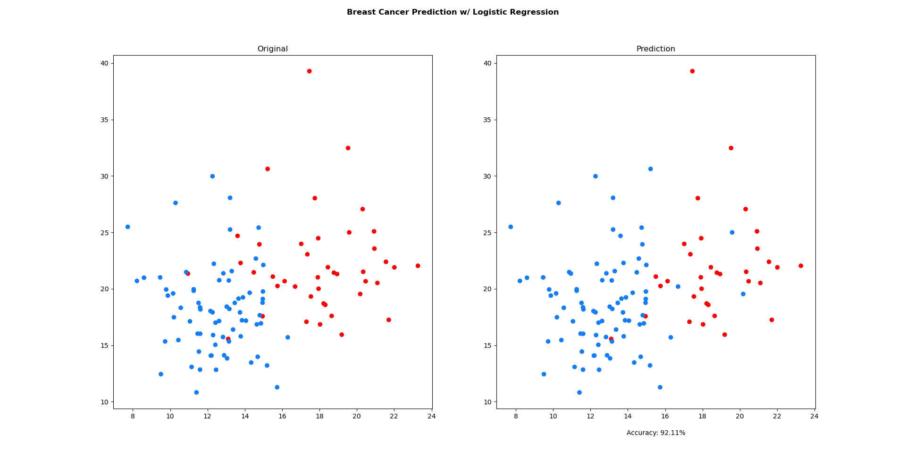

# ML Fundamentals
Repositório onde implemento algoritmos famosos de Machine Learning e os aplico em datasets para resolver problemas de regressão e classificação.

## KNN

O dataset foi particionado em um dataset de treino e outro de teste, por isso não há tantos data points quanto no Wine original.

## Linear Regression

## Logistic Regression

